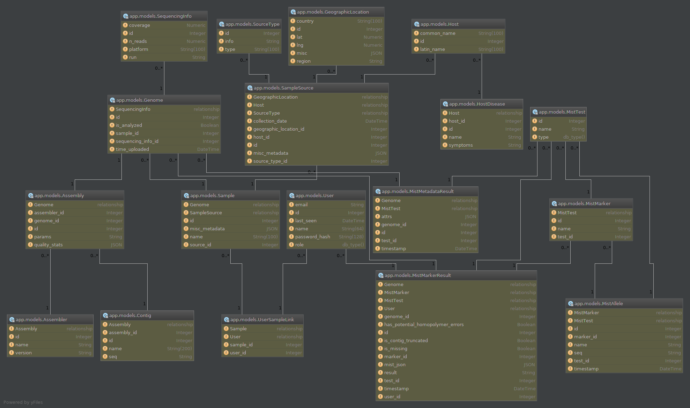

=====================
SISTR Database Schema
=====================

Schema Diagram
==============

:download:`Download the schema diagram <figures/schema-diagram.png>`

SQLAlchemy Models
=================

.. contents::

.. _User:

User
--------

.. autoclass:: app.models.User
    :members:
    :undoc-members:

.. _UserRole:

UserRole
----------

.. autoclass:: app.models.UserRole
    :members:
    :undoc-members:

Sample
---------

.. autoclass:: app.models.Sample
    :members:
    :undoc-members:

.. _Genome:

Genome
--------

.. autoclass:: app.models.Genome
    :members:
    :undoc-members:

.. _MistTest:

MistTest
--------

.. autoclass:: app.models.MistTest
    :members:
    :undoc-members:

.. _MistTestType:

MistTestType
----------

.. autoclass:: app.models.MistTestType
    :members:
    :undoc-members:

.. _MistMarker:

MistMarker
-----------

.. autoclass:: app.models.MistMarker
    :members:
    :undoc-members:

.. _MistAllele:

MistAllele
---------------------

.. autoclass:: app.models.MistAllele
    :members:
    :undoc-members:

.. _Host:

Host
---------------------

.. autoclass:: app.models.Host
    :members:
    :undoc-members:

.. _GeographicLocation:

GeographicLocation
---------------------

.. autoclass:: app.models.GeographicLocation
    :members:
    :undoc-members:

.. _Contig:

Contig
---------------------

.. autoclass:: app.models.Contig
    :members:
    :undoc-members:

.. _MistMetadataResult:

MistMetadataResult
---------------------

.. autoclass:: app.models.MistMetadataResult
    :members:
    :undoc-members:

.. _MistMarkerResult:

MistMarkerResult
---------------------

.. autoclass:: app.models.MistMarkerResult
    :members:
    :undoc-members:
